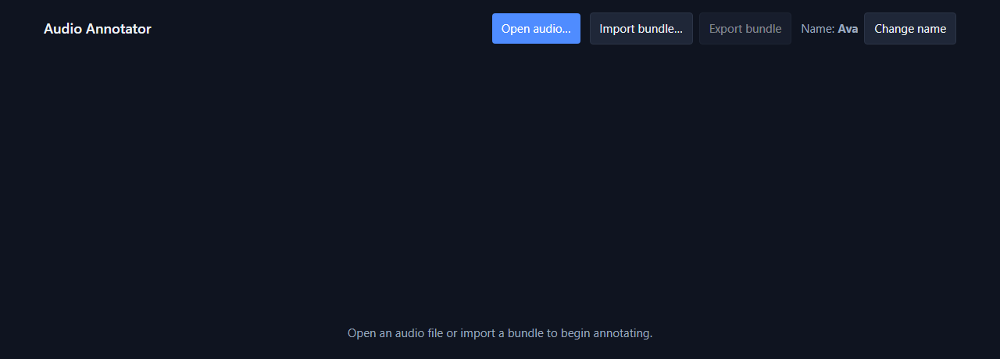
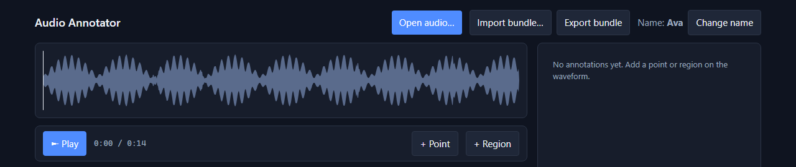
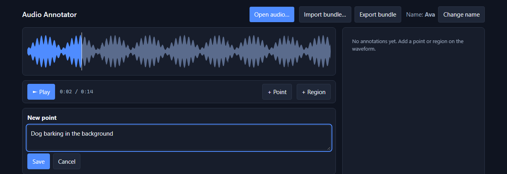
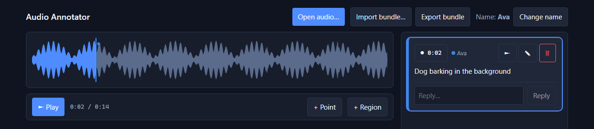
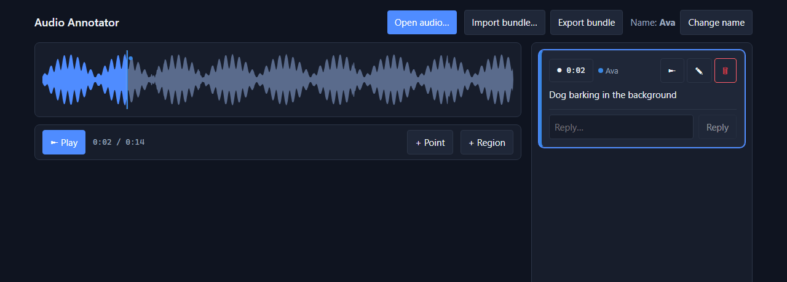
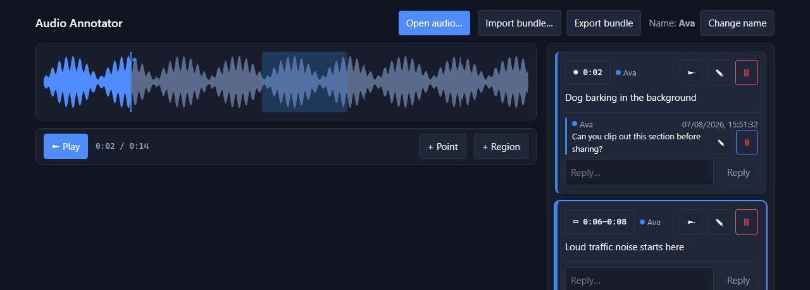
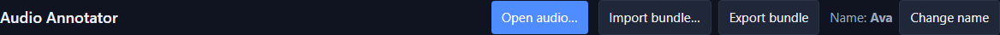

# Audio Annotator

A fully client-side, local-first web app for annotating audio files. Load an audio file,
place point and region annotations on the waveform timeline, discuss them in threaded
replies, and share your work by exporting a self-contained bundle that anyone can import
— no accounts, no server, no network required after the first load.

**Live app**: [https://yati1.github.io/audio-annotator/](https://yati1.github.io/audio-annotator/)

## Features

- **Point and region annotations** — mark a single timestamp or a span of audio with a text note
- **Threaded replies** — respond to any annotation; discussions are attached to the audio they reference
- **Offline-first** — all data lives in your browser's IndexedDB; nothing is sent to a server
- **Share via bundle** — export a `.aaz` file (a zip containing the audio and `annotations.json`) and send it by email, Drive, etc.; the recipient imports it and can add their own annotations then send it back
- **Merge on import** — re-importing a bundle from the same original merges annotations and replies by unique ID; no data is silently lost

## Supported audio formats

MP3, WAV, OGG, M4A / AAC, FLAC (native browser decoding, no transcoding)

---

## Using the app

### 1. Set your display name

The first time you open the app you'll be asked for a display name. It's stored
locally and attached to everything you annotate — there are no accounts or
sign-in. You can change it any time from **Change name** in the header.

### 2. Open an audio file

Click **Open audio…** in the header and pick a local file. The waveform renders
in the stage below; nothing leaves your browser.





### 3. Add a point annotation

Play or scrub to the moment you want to mark, then click **+ Point** in the
transport bar (or press <kbd>P</kbd>). Type a note and click **Save**.





### 4. Add a region annotation

Drag across a span of the waveform to select it, or click **+ Region** (or
press <kbd>R</kbd>) to start a 5-second region at the playhead (shorter if
started within 5 seconds of the end of the file), then add a note the same
way. You can also click directly on a region drawn on the waveform to select
it.



The waveform also supports a scroll wheel to zoom in/out, a double-click to
reset the zoom to fit the whole clip, and dragging with both mouse buttons
held to pan.

Press **►** on any annotation in the side panel to play it back — regions
play from their start and stop automatically at their end; points move the
playhead to that moment. Clicking elsewhere on the row just selects/highlights
it.

### 5. Reply to an annotation

Every annotation has its own threaded discussion. Type in the **Reply…** box
under any annotation and click **Reply** to add to the thread; replies are
attributed to your display name.



### 6. Share your work

Use **Export bundle** to download a `.aaz` file — a zip containing the audio
and all annotations/replies. Send it however you like — email, Slack, a shared drive.
The recipient opens the app and clicks **Import bundle…** to load it.



Re-importing a bundle that traces back to the same original audio **merges**
annotations and replies by ID instead of duplicating them, so a
back-and-forth of edits between collaborators never loses data.

### Keyboard shortcuts

| Key | Action |
|-----|--------|
| <kbd>Space</kbd> | Play / pause |
| <kbd>P</kbd> | Start a new point annotation at the playhead |
| <kbd>R</kbd> | Start a new 5-second region annotation at the playhead |

Shortcuts are inert until an audio file is loaded, and are ignored while
you're typing in a text field.

---

## Prerequisites

- **Node.js 20 LTS** (or newer) and **npm 10+**
- A modern desktop browser (Chrome, Firefox, or Safari)

---

## Development

```bash
# Install dependencies
npm install

# Start the dev server (http://localhost:5173/audio-annotator/)
npm run dev
```

The Vite base path is `/audio-annotator/` to match the GitHub Pages sub-path.  
The dev server serves the app under the same path.

---

## Building

```bash
# Type-check, then build optimised assets into dist/
npm run build

# Preview the production build locally
npm run preview
```

The build output lands in `dist/`. The entry JavaScript payload is kept under **200 KB
gzip** by a budget gate (see [Testing](#testing)).

---

## Testing

```bash
# Unit + integration tests (Vitest + fake-indexeddb)
npm run test

# Watch mode
npm run test:watch

# End-to-end tests (Playwright — requires the dev server to be running, or
# Playwright starts it automatically)
npm run test:e2e

# Lint and format check (ESLint + Prettier)
npm run lint

# Auto-fix formatting
npm run format

# Type-check only
npm run typecheck

# Bundle-size budget check (run after build)
npm run build && npm run size
```

### Test layout

| Path | What it covers |
|------|---------------|
| `tests/unit/` | Pure domain logic: annotation validation, reply service, bundle codec, merge algorithm, import error taxonomy |
| `tests/integration/` | `StoragePort` with fake-indexeddb: put/get/list/cascade-delete, session meta, annotation and reply persistence |
| `tests/e2e/` | Playwright: annotate → reload, reply threads, export → import round-trip, performance timing |

### Validation scenarios

The [quickstart guide](specs/001-audio-annotation-webapp/quickstart.md) lists seven
end-to-end scenarios (A–G) that map the spec's success criteria to specific test commands
and manual checks.

---

## Deploying to GitHub Pages

Deployment is fully automated via GitHub Actions.

1. **Push to `main`** — CI runs lint → typecheck → tests → build → size budget check.
2. On success the `dist/` folder is published to GitHub Pages via
   `actions/deploy-pages`.
3. Enable Pages in your repository settings (**Settings → Pages → Source: GitHub
   Actions**) if you have not already done so.

The workflow is defined in [`.github/workflows/deploy.yml`](.github/workflows/deploy.yml).

### Manual deploy (one-off)

```bash
npm run lint
npm run typecheck
npm run test
npm run build
npm run size
# Then upload dist/ to any static host or push the workflow manually
```

---

## Project structure

```
src/
├── app/           Single-view layout shell (App.tsx)
├── components/    Presentational React components
│   └── states/    Loading / Empty / Error / Toast primitives
├── features/      Framework-agnostic domain logic (unit-tested)
│   ├── audio/     Load, validate, metadata
│   ├── annotations/  Create / edit / validate point & region annotations
│   ├── replies/   Threaded reply operations
│   ├── bundle/    Export zip, import & validate, merge-by-ID
│   └── storage/   IndexedDB StoragePort
├── lib/           id (UUID), time, result (typed errors), color (author color assignment)
├── state/         zustand store wiring features to UI
└── styles/        Design tokens (tokens.css), global reset, layout (app.css)

tests/
├── unit/          Pure logic — no DOM or DB
├── integration/   StoragePort with fake-indexeddb
└── e2e/           Playwright browser tests

specs/001-audio-annotation-webapp/
├── spec.md        Feature specification
├── plan.md        Technical plan and architecture
├── research.md    Technology decisions and rationale
├── data-model.md  Entities, validation rules, merge lifecycle
├── contracts/     Bundle format, JSON Schema, storage & module interfaces
├── quickstart.md  Build / run / validation scenarios
└── tasks.md       Implementation task list
```

---

## Tech stack

| Concern | Library |
|---------|---------|
| Framework | React 18 + TypeScript 5 (ES2022) |
| Build | Vite 5 |
| Waveform | wavesurfer.js v7 + Regions plugin |
| Local storage | IndexedDB via `idb` |
| Zip bundles | `fflate` |
| State | `zustand` |
| Unit / integration tests | Vitest + React Testing Library + fake-indexeddb |
| E2E tests | Playwright |
| Linting | ESLint + typescript-eslint + Prettier |
