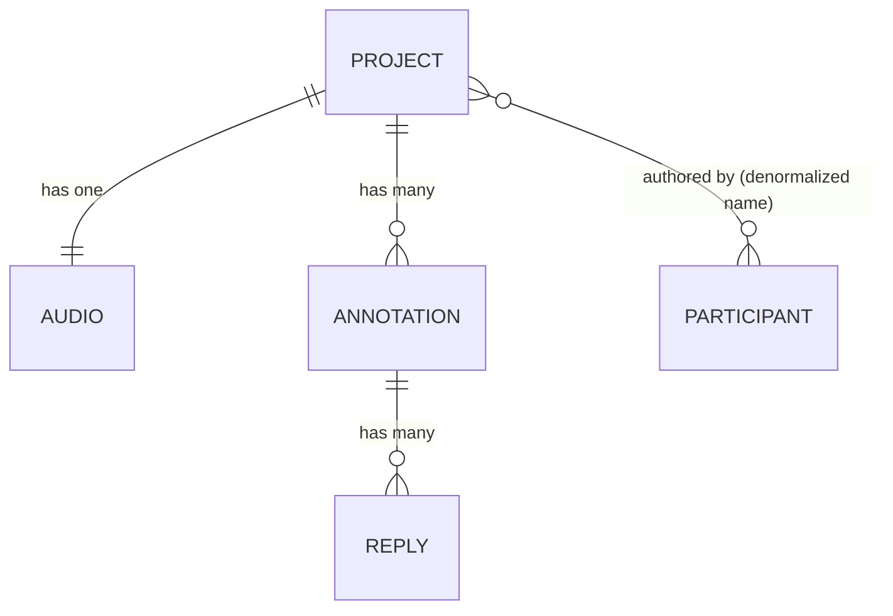

# Phase 1 Data Model: Audio Annotation Web App

Derived from the [spec](spec.md) Key Entities and Functional Requirements. This model
describes the domain as it is persisted locally (IndexedDB) and serialized into the
shareable bundle (`annotations.json`). It is storage- and framework-agnostic; concrete
IndexedDB stores and JSON layout are defined in [contracts/](contracts/).

## Entity overview



## Entities

### Project

Represents one audio file together with all its annotations and reply threads — the unit
that is persisted locally and exported/imported as a bundle.

| Field | Type | Rules |
|-------|------|-------|
| `id` | UUID (string) | Required. Stable identity of the original audio project; preserved across export/import so re-imports of the same original merge (FR-028). |
| `title` | string | Required. Defaults to the imported audio file name. |
| `audioId` | UUID (string) | Required. References the stored `Audio` record. |
| `schemaVersion` | integer | Required. Bundle/record schema version for forward compatibility. |
| `createdAt` | ISO 8601 string | Required. |
| `updatedAt` | ISO 8601 string | Required. Updated on any annotation/reply mutation. |

### Audio

The base audio being annotated. Binary content is stored locally; only metadata is
serialized in `annotations.json` (the raw file itself is a separate zip entry).

| Field | Type | Rules |
|-------|------|-------|
| `id` | UUID (string) | Required. |
| `fileName` | string | Required. Original file name, e.g. `interview.mp3`. |
| `mimeType` | string | Required. One of the supported types (FR-030): `audio/mpeg`, `audio/wav`, `audio/ogg`, `audio/mp4`/`audio/aac`, `audio/flac`. |
| `durationSec` | number | Required. Total duration in seconds (≥ 0). Establishes valid timestamp range. |
| `byteSize` | integer | Required. Used only for the "large file may be slow" notice (FR-029); no hard limit. |
| `blob` | Blob (binary) | Required in storage; NOT in `annotations.json` (stored as the audio entry in the zip). |

### Annotation

A note anchored to the audio, either a single point or a time region.

| Field | Type | Rules |
|-------|------|-------|
| `id` | UUID (string) | Required. Stable across export/import; merge key (FR-027). |
| `projectId` | UUID (string) | Required. Owning project. |
| `kind` | enum `"point"` \| `"region"` | Required. |
| `startSec` | number | Required. `0 ≤ startSec ≤ audio.durationSec`. |
| `endSec` | number \| null | `null` when `kind = "point"`. When `kind = "region"`: required, `startSec < endSec ≤ durationSec` (FR-010 rejects `end ≤ start` and zero-length regions). |
| `note` | string | Required, non-empty (FR-006). |
| `authorName` | string | Required. Self-entered display name at authoring time (FR-021); not unique/verified. |
| `createdAt` | ISO 8601 string | Required (FR-012). |
| `updatedAt` | ISO 8601 string | Required. |
| `deleted` | boolean | Optional, default `false`. Soft-delete tombstone so deletions survive merges without resurrecting on re-import. |

**Validation (FR-010):**
- `kind = "point"` ⇒ `endSec === null`.
- `kind = "region"` ⇒ `endSec !== null && endSec > startSec`.
- `0 ≤ startSec` and (`endSec ?? startSec`) `≤ audio.durationSec`. Out-of-range values are
  clamped/flagged, not silently dropped (spec edge case).

### Reply

A response within an annotation's thread.

| Field | Type | Rules |
|-------|------|-------|
| `id` | UUID (string) | Required. Merge key (FR-027). |
| `annotationId` | UUID (string) | Required. Owning annotation. |
| `text` | string | Required, non-empty (FR-013). |
| `authorName` | string | Required. Display name at authoring time (FR-021). |
| `createdAt` | ISO 8601 string | Required. Sort key for chronological display (FR-014). |
| `updatedAt` | ISO 8601 string | Required. |
| `deleted` | boolean | Optional, default `false`. Soft-delete tombstone (FR-015; survives merge). |

### Participant (value, not a stored aggregate)

There are no accounts (FR-025). "Participant" is just the self-entered `authorName`
denormalized onto each Annotation and Reply. The current session's display name is held in
UI/session state (see storage contract `sessionMeta`) and is neither unique nor verified.

## Lifecycle & state transitions

### Annotation
```
(none) --create--> active --edit--> active --delete(confirm)--> deleted(tombstone)
```
- Region playback (FR-003) is a runtime action, not a persisted state.

### Reply
```
(none) --create--> active --edit--> active --delete(confirm)--> deleted(tombstone)
```

### Project (import/merge)
```
import bundle:
  if project.id unknown      -> create new project (open as project, FR-028)
  if project.id already local-> merge by unique ID (union):
       annotations/replies:  add unseen ids; keep existing;
       same id, both present:
           if one deleted     -> deleted wins (tombstone)
           else if content differs -> keep both / flag conflict (no silent loss)
```

Merge is deterministic and depends only on `id` + `deleted` + content equality, making it
unit-testable (Constitution II). See [contracts/storage-and-modules.md](contracts/storage-and-modules.md)
for the `mergeProject` contract and [contracts/bundle-format.md](contracts/bundle-format.md)
for serialization.

## Invariants

- Every Annotation and Reply has a stable UUID `id` preserved through export/import.
- A Reply's `annotationId` always resolves to an Annotation in the same Project.
- All timestamps lie within `[0, audio.durationSec]` (clamped/flagged otherwise).
- Deletions are tombstones, not physical removals, until a project is discarded, so merges
  never resurrect deleted items.
- `schemaVersion` in storage and in a bundle must be readable by the app (import validates
  it; unknown newer versions produce a clear error, FR-026).
